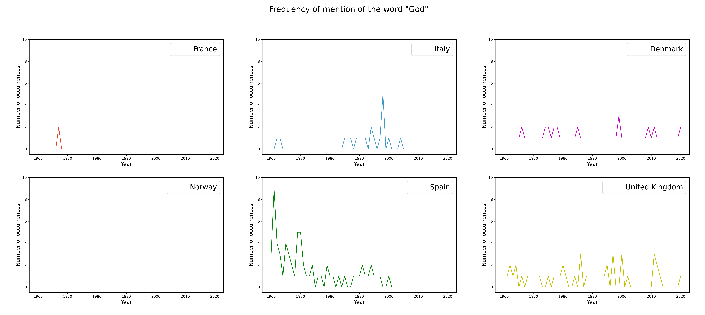
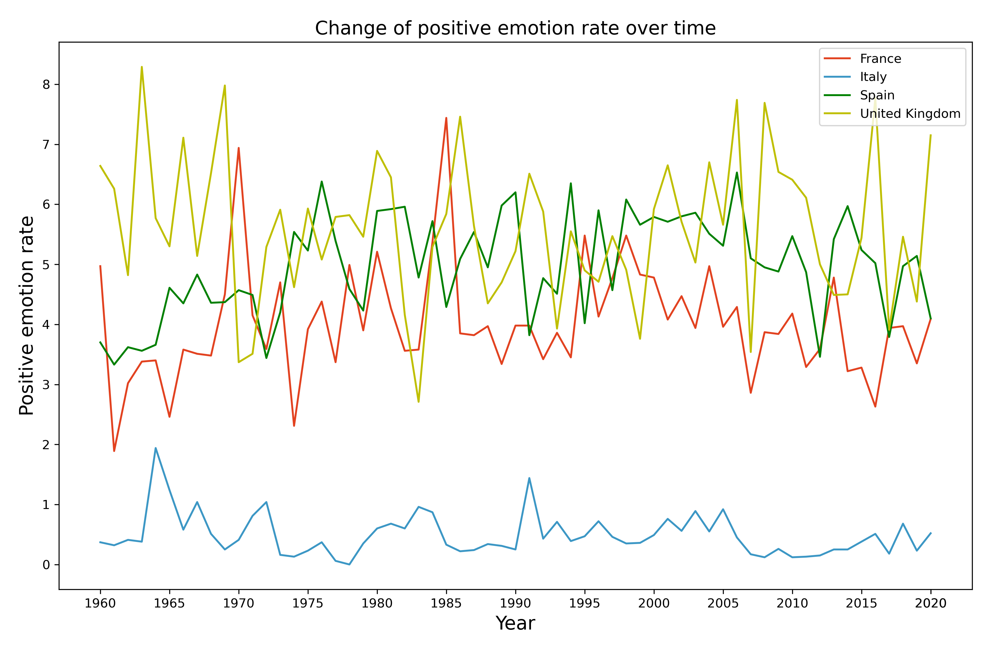
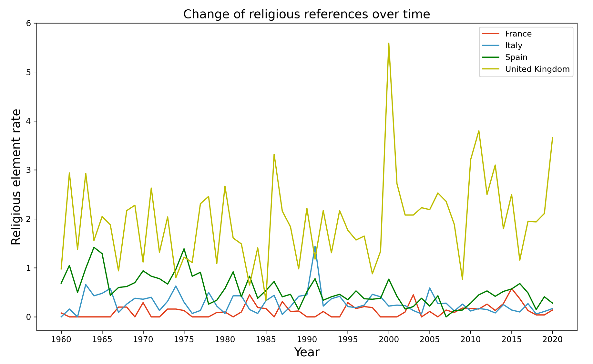

# a_corpus_of_New_Years_Speeches

Shield: [![CC BY 4.0][cc-by-shield]][cc-by]

This work is licensed under a
[Creative Commons Attribution 4.0 International License][cc-by].

[![CC BY 4.0][cc-by-image]][cc-by]

[cc-by]: http://creativecommons.org/licenses/by/4.0/
[cc-by-image]: https://i.creativecommons.org/l/by/4.0/88x31.png
[cc-by-shield]: https://img.shields.io/badge/License-CC%20BY%204.0-lightgrey.svg

The NewYeS (New Year's Speeches) corpus is a multilingual corpus that comprises transcripts of Christmas messages and New Year's speeches held at the end of the year by the heads of state of different European countries - i.e. Denmark, France, Italy, Norway, Spain and the United Kingdom. 

The corpus was collected from various web sources, mainly official royal or presidential websites. The speeches are divided by country, and each speech is contained in a .txt file that follows the "country_year" denomination. 

The speech transcripts span from varying starting years until 2021, depending on web availability.
- Denmark: 1946-2021
- Italy and Spain: 1949-2021
- United Kingdom: 1952-2021
- Norway: 1957-2021
- France: 1960-2021

The NewYeS corpus was introduced by ["NewYeS: A Corpus of New Year’s Speeches with a Comparative Analysis"](http://www.lrec-conf.org/proceedings/lrec2022/workshops/PoliticalNLP/2022.politicalnlp-1.0.pdf) (Tramarin & Strapparava, 2022). Please refer to this paper when citing the corpus.

A comparative analysis was performed on the texts - some of the elements analysed are the frequency of the mention of the word "God", the positive emotion rate and the frequency of religious elements.

